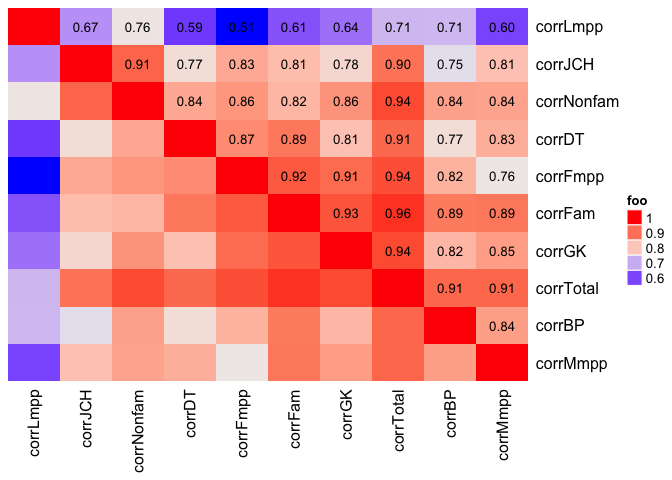

PJ's Oral Fixation
================

Tidy data up
============

``` r
data <- read_csv("Raw Binary Output(AutoRecovered).csv")
data <- data[1:65,]
write_csv(data, "data.csv")


# metaData <- readxl::read_xlsx("Survey Data.xlsx")
# write_csv(metaData1, "metaData.csv")
```

Import data
===========

``` r
data <- read_csv("data.csv")
```

    ## Parsed with column specification:
    ## cols(
    ##   .default = col_integer()
    ## )

    ## See spec(...) for full column specifications.

``` r
metaDataParticipants <- read_csv("metaDataParticipants.csv")
```

    ## Parsed with column specification:
    ## cols(
    ##   Participant = col_integer(),
    ##   Age = col_character(),
    ##   BSex = col_character(),
    ##   Concerts = col_character(),
    ##   Dyslexia = col_character(),
    ##   Dysfamily = col_character(),
    ##   Multilingual = col_character(),
    ##   EFL = col_character(),
    ##   Hearing = col_character(),
    ##   Hearfamily = col_character(),
    ##   Tinnitus = col_character(),
    ##   Visioncorr = col_character(),
    ##   Visionwear = col_character(),
    ##   Vision = col_character(),
    ##   Visionfamily = col_character(),
    ##   Music = col_character(),
    ##   EarTrain = col_character(),
    ##   Linguist = col_character()
    ## )

``` r
# metaDataPhonemes <- read_csv("metaDataPhonemes.csv")
```

ANOVA
=====

``` r
data %>% 
  select(corrTotal) %>% 
  bind_cols(metaDataParticipants %>% select(Music)) %>% 
  aov(data = ., formula = corrTotal ~ Music) %>% 
  tidy() %>% 
  kable()
```

| term      |   df|      sumsq|     meansq|  statistic|    p.value|
|:----------|----:|----------:|----------:|----------:|----------:|
| Music     |    1|   1332.328|  1332.3276|   4.408036|  0.0397817|
| Residuals |   63|  19041.734|   302.2497|         NA|         NA|

``` r
data %>% 
  select(corrTotal) %>% 
  bind_cols(metaDataParticipants %>% select(EarTrain)) %>% 
  aov(data = ., formula = corrTotal ~ EarTrain)%>% 
  tidy()%>% 
  kable()
```

| term      |   df|       sumsq|    meansq|  statistic|    p.value|
|:----------|----:|-----------:|---------:|----------:|----------:|
| EarTrain  |    1|    440.4103|  440.4103|    1.39191|  0.2425187|
| Residuals |   63|  19933.6513|  316.4072|         NA|         NA|

``` r
data %>% 
  select(corrTotal) %>% 
  bind_cols(metaDataParticipants %>% select(Multilingual, EFL)) %>% 
  aov(data = ., formula = corrTotal ~ Multilingual + EFL)%>% 
  tidy()%>% 
  kable()
```

| term         |   df|       sumsq|    meansq|  statistic|    p.value|
|:-------------|----:|-----------:|---------:|----------:|----------:|
| Multilingual |    1|    114.3795|  114.3795|  0.3666888|  0.5470986|
| EFL          |    3|   1544.1582|  514.7194|  1.6501362|  0.1873692|
| Residuals    |   60|  18715.5238|  311.9254|         NA|         NA|

``` r
data %>% 
  select(corrTotal) %>% 
  bind_cols(metaDataParticipants %>% select(Tinnitus)) %>% 
  aov(data = ., formula = corrTotal ~ Tinnitus)%>% 
  tidy()%>% 
  kable()
```

| term      |   df|         sumsq|      meansq|  statistic|    p.value|
|:----------|----:|-------------:|-----------:|----------:|----------:|
| Tinnitus  |    1|      6.791558|    6.791558|  0.0210076|  0.8852209|
| Residuals |   63|  20367.269981|  323.290000|         NA|         NA|

Control vs Total
================

``` r
data %>% 
  select(corrTotal, corrControl) %>% 
  mutate(corrTotal = corrTotal/187) %>% 
  mutate(corrControl = corrControl/5) %>% 
  cor() %>% 
  kable()
```

|             |  corrTotal|  corrControl|
|-------------|----------:|------------:|
| corrTotal   |  1.0000000|    0.5800073|
| corrControl |  0.5800073|    1.0000000|

Correlations
============

``` r
cor_mat <- data %>% 
  select(corrTotal, corrJCH, corrFam, corrLmpp, corrGK, corrBP, corrDT, corrMmpp, corrFmpp, corrNonfam) %>% 
  # ggplot(aes(x = corrTotal, y = corrJCH))+
  # geom_point()
  cor() #%>% 

od = hclust(dist(cor_mat))$order
cor_mat = cor_mat[od, od]
nm = rownames(cor_mat)  

ComplexHeatmap::Heatmap(cor_mat, name = "foo", cell_fun = function(j, i, x, y, width, height, fill) {
    if (i < j)
    grid.text(sprintf("%.2f", cor_mat[i, j]), x, y, gp = gpar(fontsize = 10))
}, cluster_rows = FALSE, cluster_columns = FALSE)
```



``` r
# col_fun = circlize::colorRamp2(c(0.45, 1), c("blue", "red"))
# # `col = col_fun` here is used to generate the legend
# hm <- ComplexHeatmap::Heatmap(cor_mat, name = "correlation", col = col_fun, rect_gp = gpar(type = "none"), 
#     cell_fun = function(j, i, x, y, width, height, fill) {
#         grid.rect(x = x, y = y, width = width, height = height, gp = gpar(col = "grey", fill = NA))
#         if(i == j) {
#             grid.text(nm[i], x = x, y = y)
#         } else if(i > j) {
#             # grid.circle(x = x, y = y, r = abs(cor_mat[i, j])/2 * min(unit.c(width, height)), 
#             #     gp = gpar(fill = col_fun(cor_mat[i, j]), col = NA))
#             grid.draw(x = x, y = y, width = width, height = height, gp = gpar(fill = col_fun(cor_mat[i, j]), col = NA))
#         } else {
#             grid.text(sprintf("%.3f", cor_mat[i, j]), x, y, gp = gpar(fontsize = 8))
#         }
#     }, cluster_rows = FALSE, cluster_columns = FALSE,
#     show_row_names = FALSE, show_column_names = FALSE)
```
